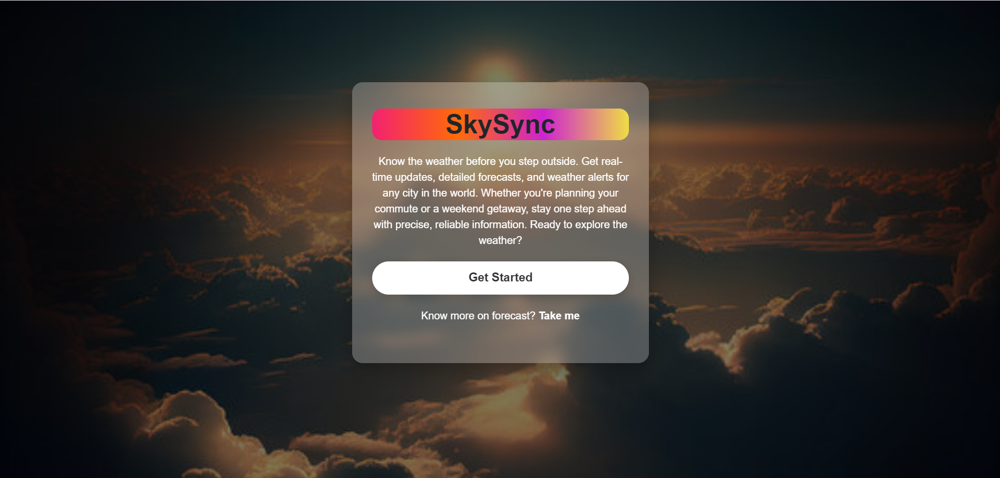
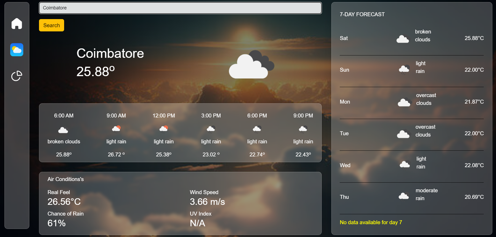
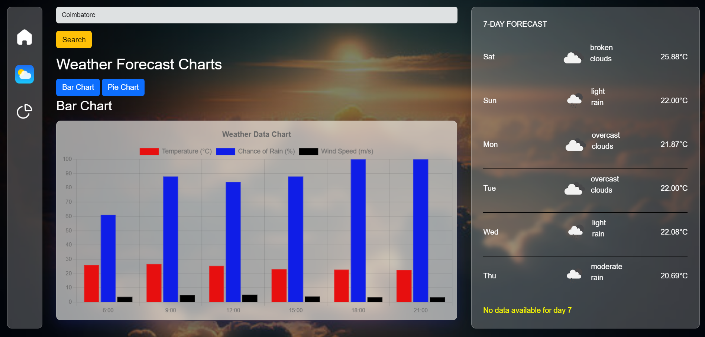
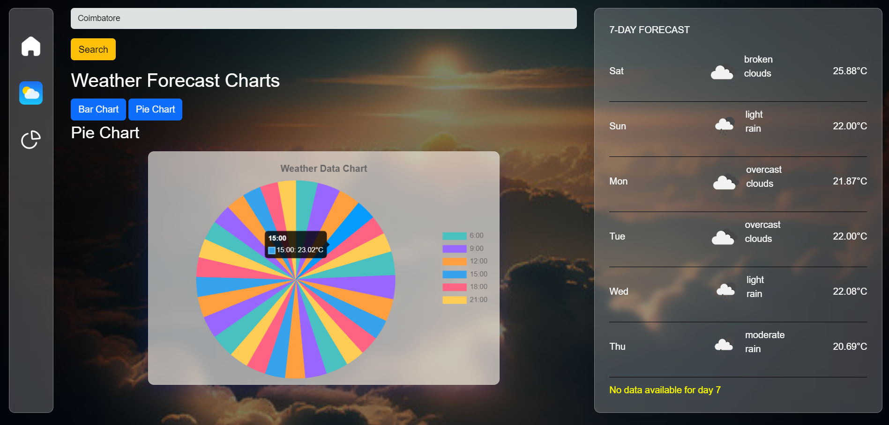

# SkySync - Weather Forecasting App

SkySync is a weather forecasting app that provides accurate and up-to-date weather information for any city. The app displays the current temperature, a detailed weather forecast for today in 3-hour intervals, and weather predictions for the next 7 days. It also includes air conditions like real feel, wind speed, chance of rain, and UV index. Additionally, SkySync features a data visualization page with bar and pie charts, offering a clear and concise view of weather data.

## Features

- **Current Weather**: Displays the current temperature for a selected city.
- **Today's Forecast**: Shows weather details for every 3 hours starting from 6 AM.
- **7-Day Forecast**: Provides weather predictions for the upcoming week.
- **Air Conditions**: Real feel, wind speed, chance of rain, and UV index.
- **Data Visualization**: Bar and pie charts to visualize weather data for better insights.

## Technologies Used

- **React.js**: For building the user interface and managing state.
- **OpenWeatherMap API**: To fetch real-time weather data for any city.
- **Chart.js**: Used to create bar and pie charts for visual representation of weather data.

## Screenshots

### Home Page



### Weather Details



### Bar Chart



### Pie Chart



## Live Demo

Check out the live version of SkySync: _[Live Link](https://skysync-weather-forecasting-app.netlify.app)

## Getting Started

Follow these instructions to set up and run the project locally.

### Prerequisites

- **Node.js**: You can download and install Node.js from [here](https://nodejs.org/). It includes npm (Node Package Manager), which you'll use to install the project dependencies.

### Installation

1.Clone the repository:
   ```bash
   git clone https://github.com/SathishKumar-2004/Weather-Forecasting-app.git
   ```

2.Navigate to the folder:
   ```bash
   cd Weather-Forecasting-app
   ```

### Install Dependencies:
   ```bash
   npm install
   ```

### Start the Development Server:
   ```bash
   npm run dev
   ```
